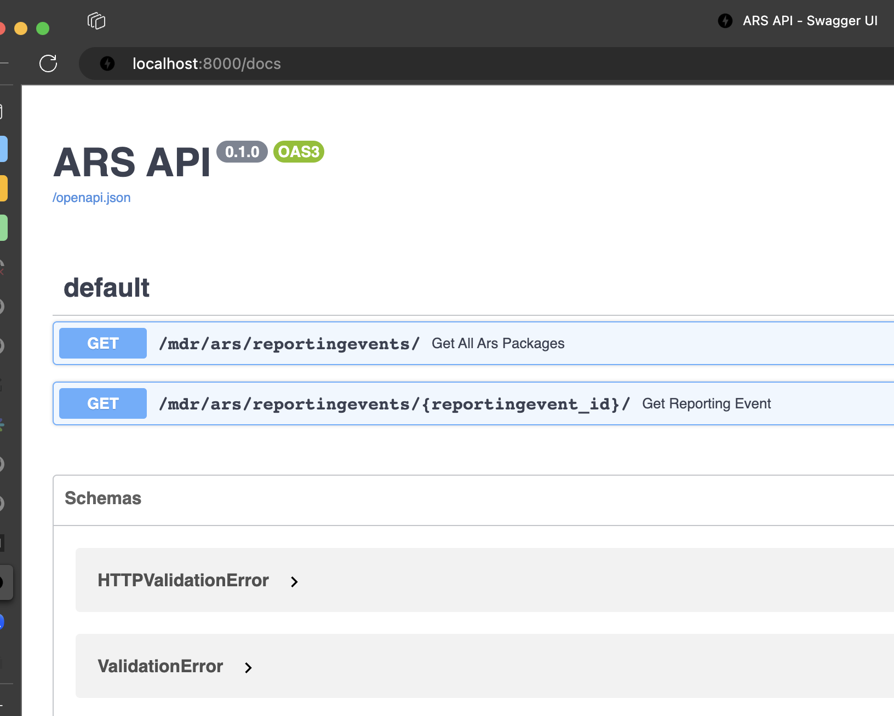

# Analysis Result Standard API (ARS)

This is the api service for Analysis Result Standard

# *ARS API* 

This repository should be used for the *ARS Hackathon* to contain code, minutes, notes, outcomes, discussions and more. It is meant to allow anyone working with the results and discussions to allow flexible collaboration and follow up projects.

## Description

The main purpose of *ARS Hackathon* is to find creative uses of ARS and it's model


## Installation

Use the package manager [pip](https://pip.pypa.io/en/stable/) to install foobar.

```bash
pip install -r requirements.txt
```

## Usage

Use uvicorn to start a WSGI server locally.
```bash
uvicorn main:app
```

By default, the server will start listening to port 8000 for traffic. Use `http://localhost:8000/docs` to explore the Swagger documentation of the ARS service.



## Contribution

Contribution is very welcome. When you contribute to this repository you are doing so under the below licenses. Please checkout [Contribution](CONTRIBUTING.md) for additional information. All contributions must adhere to the following [Code of Conduct](CODE_OF_CONDUCT.md).

## License

 

### Code & Scripts

This project is using the [MIT](http://www.opensource.org/licenses/MIT "The MIT License | Open Source Initiative") license (see [`LICENSE`](LICENSE)) for code and scripts.

### Content

The content files like documentation and minutes are released under [CC-BY-4.0](https://creativecommons.org/licenses/by/4.0/). This does not include trademark permissions.

## Re-use

When you re-use the source, keep or copy the license information also in the source code files. When you re-use the source in proprietary software or distribute binaries (derived or underived), copy additionally the license text to a third-party-licenses file or similar.

When you want to re-use and refer to the content, please do so like the following:

> Content based on [Project XY (GitHub)](https://github.com/xy/xy) used under the [CC-BY-4.0](https://creativecommons.org/licenses/by/4.0/) license.


